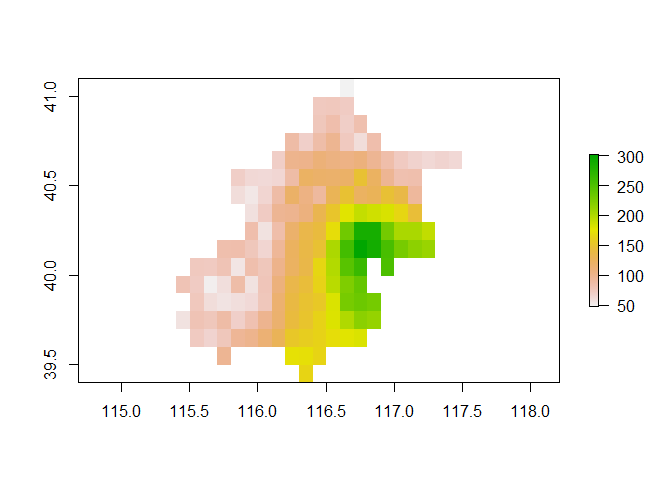
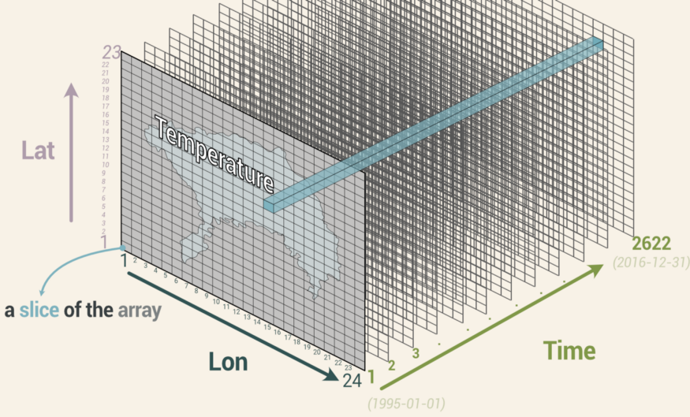

<!-- README.md is generated from README.Rmd. Please edit that file -->

# R语言地理信息数据处理

李志伟 (<lizhiwei@ccmu.edu.cn>)

首都医科大学公共卫生学院，流行病和卫生统计学系

北京市丰台区右安门外西头条10号

*本教程所有出现的代码可以在`code/code.r`文件中找到。*
*生成此教程的代码可以在`README.Rmd`文件中找到。*

## 含经纬度的点数据转换成地图栅格数据

### 经纬度点数据加载

首先加载含经纬度的点数据。

``` r
pts = read.csv('data/20040101_PM25_and_species.csv')
head(pts)
#>    X_Lon Y_Lat PM2.5
#> 1 116.35 39.45   165
#> 2 115.75 39.55    97
#> 3 116.25 39.55   173
#> 4 116.35 39.55   172
#> 5 116.45 39.55   165
#> 6 115.55 39.65    73
```

### 点数据到面数据

转换的过程需要使用`raster`包。

``` r
library(raster)
#> 载入需要的程辑包：sp
```

使用`raster`包中的`rasterFromXYZ()`函数可以将含经纬度的点数据转换成地图栅格数据。

``` r
rs = raster::rasterFromXYZ(pts)
```

使用`plot()`函数查看转换结果。

``` r
plot(rs)
```

<!-- -->

### 添加坐标系

查看`rs`文件的坐标系。

``` r
crs(rs)
#> Coordinate Reference System:
#> Deprecated Proj.4 representation: NA
#> Warning in wkt(x): CRS object has no comment
```

转换的`rs`文件没有坐标系，我们手动给他设置一个。
根据[这个网站](https://gis.stackexchange.com/questions/111226/how-to-assign-crs-to-rasterlayer-in-r)的介绍，使用`'+init=EPSG:4326'`可以更容易适应其他参考系统。

> The result is the same, but this version is easier adaptable to other
> reference systems: `crs(r) <- CRS('+init=EPSG:4326')` if you know the
> EPSG number.

``` r
crs(rs) <- CRS('+init=EPSG:4326')
```

再次查看`rs`文件的坐标系。

``` r
crs(rs)
#> Coordinate Reference System:
#> Deprecated Proj.4 representation: +proj=longlat +datum=WGS84 +no_defs 
#> WKT2 2019 representation:
#> GEOGCRS["WGS 84",
#>     DATUM["World Geodetic System 1984",
#>         ELLIPSOID["WGS 84",6378137,298.257223563,
#>             LENGTHUNIT["metre",1]],
#>         ID["EPSG",6326]],
#>     PRIMEM["Greenwich",0,
#>         ANGLEUNIT["degree",0.0174532925199433],
#>         ID["EPSG",8901]],
#>     CS[ellipsoidal,2],
#>         AXIS["longitude",east,
#>             ORDER[1],
#>             ANGLEUNIT["degree",0.0174532925199433,
#>                 ID["EPSG",9122]]],
#>         AXIS["latitude",north,
#>             ORDER[2],
#>             ANGLEUNIT["degree",0.0174532925199433,
#>                 ID["EPSG",9122]]],
#>     USAGE[
#>         SCOPE["unknown"],
#>         AREA["World."],
#>         BBOX[-90,-180,90,180]]]
```

### 结果保存为tif文件

将转换结果保存为`tif`文件。

``` r
writeRaster(rs,"result/rs.tif", overwrite = T)
```

### 结果验证(提取单个tif中单个经纬度下的值)

接下来我们验证导出的`rs.tif`文件能否通过经纬度，提取到`PM2.5`的浓度。
我们提取`pts`第一行的数据。原始数据如下：

``` r
head(pts,1)
#>    X_Lon Y_Lat PM2.5
#> 1 116.35 39.45   165
```

清空我们的环境。

``` r
rm(list = ls())
```

导入刚刚保存的`rs.tif`文件。

``` r
dat = brick('result/rs.tif')
```

将`pts`中的第一行经纬度保存成数据框`mypt`。

``` r
mypt = data.frame(lon = 116.35, lat = 39.45)
```

> 注意：经度必须用`lon`表示，纬度必须用`lat`表示。

`mypt`转换为`sp`格式。

``` r
mypt = SpatialPoints(mypt, proj4string=CRS("+proj=longlat +datum=WGS84"))
class(mypt)
#> [1] "SpatialPoints"
#> attr(,"package")
#> [1] "sp"
```

#### extract()提取单个经纬度下的值

使用`extract()`提取`lon = 116.35`和`lat = 39.45`位置下`PM2.5`的浓度。

``` r
extract(dat, mypt)
#>       rs
#> [1,] 165
```

#### extract()提取多个经纬度下的值

`extract()`函数还能一次提取多个经纬度的数据。

创建包含3个经纬度的数据框。并转换为`sp`格式。

``` r
mypt2 = data.frame(lon = c(116.35, 115.75, 116.25), lat = c(39.45, 39.55, 39.55))
mypt2
#>      lon   lat
#> 1 116.35 39.45
#> 2 115.75 39.55
#> 3 116.25 39.55
```

转换为`sp`格式。

``` r
mypt2 = SpatialPoints(mypt2, proj4string=CRS("+proj=longlat +datum=WGS84"))
```

使用`extract()`函数提取`mypt2`中经纬度下`PM2.5`的浓度。

``` r
extract(dat, mypt2)
#>       rs
#> [1,] 165
#> [2,]  97
#> [3,] 173
```

## 从netCDF4(nc)文件中提取特定坐标下的值

### 预处理

> 注意：以下清空环境的操作会让你R中的所有对象和R包都清空！！！所以在执行以下操作前，请确保所有重要的数据都已保存。或者你可以重新打开一个新的Rstudio来运行下边的代码。

为了防止不同包中的函数冲突，我们需要清空环境。

首先运行:

``` r
rm(list = ls())
```

其次同时按住`Ctrl+Shift+F10`重启Rstudio。

### netCDF4文件简介

`netCDF4`文件的后缀是`.nc`。关于什么是`netCDF4`文件，我不打算做过多介绍。更详细的介绍以及如何在R中处理`netCDF4`文件可以从[这个网站](https://pjbartlein.github.io/REarthSysSci/netCDF.html)找到。

### nc数据加载

本次使用的数据`cru10min30_tmp.nc`文件来自[Climate Research
Unit](http://www.cru.uea.ac.uk/data)。包括0.5度网格上近地面空气温度的长期平均值（1961-1990年）。阵列的尺寸为`720`（经度）x`360`（纬度）x
`12`（月份），从而形成一个`12`层的堆叠nc文件。

使用`raster`包读取`nc`文件。

``` r
library(raster)
mync = brick('data/cru10min30_tmp.nc')
#> 载入需要的名字空间：ncdf4
```

### nc数据查看

查看`mync`的维度。

``` r
dim(mync)
#> [1] 360 720  12
```

`mync`有`360`个纬度，`720`个经度和`12`个月。它在`nc`文件中分布情况类似于这样(图片仅为示意图，不代表`mync`的实际数据情况。点击图片，查看图片出处)。

[](https://towardsdatascience.com/how-to-crack-open-netcdf-files-in-r-and-extract-data-as-time-series-24107b70dcd)

由于`mync`有`12`个月的温度数据，所有我们在提取某个坐标下的温度时候应该会有`12`个结果。

### 提取单个经纬度下的值在nc文件中

我们先生成一个坐标，并提取该坐标下的温度数据。

``` r
mypt = data.frame(lon = 116.35, lat = 39.45)
mypt = SpatialPoints(mypt, proj4string=CRS("+proj=longlat +datum=WGS84")) # 将mypt转换为sp
```

使用`extract()`函数提取`mypt`坐标下的温度数据。

``` r
extract(mync, mypt)
#>      X1976.01.16 X1976.02.15 X1976.03.16 X1976.04.16 X1976.05.16 X1976.06.16
#> [1,]        -3.4        -0.9           6        14.2        20.5          25
#>      X1976.07.16 X1976.08.16 X1976.09.16 X1976.10.16 X1976.11.16 X1976.12.16
#> [1,]        26.8        25.6        20.7          14         5.6        -1.3
```

可以看到提取出的数据有`1`行`12`列，分别对应`1`个坐标下的`12`个月的平均温度。

``` r
dim(extract(mync, mypt))
#> [1]  1 12
```

### 提取多个经纬度下的值在nc文件中

我们再试试提取多个坐标下的温度数据。

``` r
mypt2 = data.frame(lon = c(116.35, 115.75, 116.25), lat = c(39.45, 39.55, 39.55))
mypt2 = SpatialPoints(mypt2, proj4string=CRS("+proj=longlat +datum=WGS84")) # 将mypt2转换为sp

extract(mync, mypt2)
#>      X1976.01.16 X1976.02.15 X1976.03.16 X1976.04.16 X1976.05.16 X1976.06.16
#> [1,]        -3.4        -0.9         6.0        14.2        20.5        25.0
#> [2,]        -7.6        -4.9         2.1        10.5        17.2        21.4
#> [3,]        -4.0        -1.5         5.4        13.7        20.1        24.5
#>      X1976.07.16 X1976.08.16 X1976.09.16 X1976.10.16 X1976.11.16 X1976.12.16
#> [1,]        26.8        25.6        20.7        14.0         5.6        -1.3
#> [2,]        23.4        21.9        16.7        10.0         1.4        -5.5
#> [3,]        26.5        25.1        20.1        13.3         4.9        -1.9
```

查看数据维度可以看到有`3`行`12`列，分别对应`3`个坐标下`12`个月的温度数据。

``` r
dim(extract(mync, mypt2))
#> [1]  3 12
```

## 批量提取

首先清空环境。

``` r
rm(list = ls())
```

### 提取多个tif文件多个经纬度下的值

我们通过重复读取`result/`文件夹下的`rs.tif`文件模拟有多个`tif`文件的情况。此数据是我们在[结果保存为tif文件](#结果保存为tif文件)部分生成的。

``` r
files = c('result/rs.tif', 'result/rs.tif')
```

使用`terra`包中的`rast()`函数读取`files`中的文件。

``` r
library(terra)
#> Warning: 程辑包'terra'是用R版本4.2.1 来建造的
#> terra 1.6.7
r <- terra::rast(files)
```

创建一个含有多个经纬度的数据框。

``` r
mypt2 = data.frame(lon = c(116.35, 115.75, 116.25), lat = c(39.45, 39.55, 39.55))
```

使用`terra`包中的`extract()`函数提取`mypt2`经纬度下的值。

> `rater`包中也有一个`extract()`函数，建议还是使用`terra`包中的`extract()`函数，因为它速度更快。详情可以参考[这里](https://tmieno2.github.io/R-as-GIS-for-Economists/extraction-speed-comparison.html)。

``` r
e <- terra::extract(r, mypt2)
e
#>   ID  rs  rs
#> 1  1 165 165
#> 2  2  97  97
#> 3  3 173 173
```

可以看到数据有`3`行，代表着`mypt2`中的`3`个经纬度。同时还有`2`列，名字都是`rs`。这分别对应`files`中两个文件提取到的具体值，在本例中代表PM2.5的浓度。由于我们重复读取了`rs`文件两次，所以这`2`列的变量名都是`rs`。在实际情况中，如果你读取不同的`tif`文件，他将会显示不同`tif`文件名称。

### 提取多个nc文件多个经纬度下的值

示例数据使用的是[nc数据加载](#nc数据加载)部分的`cru10min30_tmp.nc`文件。
提取多个nc文件多个经纬度下的值与tif文件的方法一致，只需要把文件名称换一下。这里不做详细介绍，可以直接运行以下代码看结果。

``` r
files2 = c('data/cru10min30_tmp.nc', 'data/cru10min30_tmp.nc')
r2 <- terra::rast(files2)
e2 <- terra::extract(r2, mypt2)
e2
#>   ID tmp_1 tmp_2 tmp_3 tmp_4 tmp_5 tmp_6 tmp_7 tmp_8 tmp_9 tmp_10 tmp_11 tmp_12
#> 1  1  -3.4  -0.9   6.0  14.2  20.5  25.0  26.8  25.6  20.7   14.0    5.6   -1.3
#> 2  2  -7.6  -4.9   2.1  10.5  17.2  21.4  23.4  21.9  16.7   10.0    1.4   -5.5
#> 3  3  -4.0  -1.5   5.4  13.7  20.1  24.5  26.5  25.1  20.1   13.3    4.9   -1.9
#>   tmp_1 tmp_2 tmp_3 tmp_4 tmp_5 tmp_6 tmp_7 tmp_8 tmp_9 tmp_10 tmp_11 tmp_12
#> 1  -3.4  -0.9   6.0  14.2  20.5  25.0  26.8  25.6  20.7   14.0    5.6   -1.3
#> 2  -7.6  -4.9   2.1  10.5  17.2  21.4  23.4  21.9  16.7   10.0    1.4   -5.5
#> 3  -4.0  -1.5   5.4  13.7  20.1  24.5  26.5  25.1  20.1   13.3    4.9   -1.9
```

## nc文件与tif文件相互转换

首先清空环境。

``` r
rm(list = ls())
```

### 多层nc到tif

`nc`文件有很多层数据，比如`cru10min30_tmp.nc`储存这`12`个月的温度，相当于有`12`层数据。

`rast()`和`raster()`函数都可以读取`nc`数据，他们分别来自`terra`包和`raster`包。
我们分别用这两种方法读入`cru10min30_tmp.nc`文件。

``` r
nc_file = 'data/cru10min30_tmp.nc'

nc_rast = terra::rast(nc_file)
nc_raster=raster::raster(nc_file)
#> 载入需要的名字空间：ncdf4
```

我们查看一下nc_rast和nc_raster的维度。

``` r
dim(nc_rast)
#> [1] 360 720  12
dim(nc_raster)
#> [1] 360 720   1
```

可以看到，使用`terra::rast()`函数正确读取了`nc`文件，有`12`层数据。但是`raster::raster()`只读取到了nc文件中的`1`层数据。

**所以多层nc数据要用`terra::rast()`读取。**

将多层nc数据保存为tif文件。

``` r
terra::writeRaster(nc_rast, filename = 'result/多层nc_to_tif.tif', overwrite = T)
```

我们验证一下保存的`多层nc_to_tif.tif`能否正确读取。

``` r
multi_layer_tif = terra::rast('result/多层nc_to_tif.tif')
dim(multi_layer_tif)
#> [1] 360 720  12
```

成功读取到了12层数据。

再验证能否提取这12层数据。

``` r
mypt2 = data.frame(lon = c(116.35, 115.75, 116.25), lat = c(39.45, 39.55, 39.55))

extract(multi_layer_tif, mypt2)
#>   ID tmp_1 tmp_2 tmp_3 tmp_4 tmp_5 tmp_6 tmp_7 tmp_8 tmp_9 tmp_10 tmp_11 tmp_12
#> 1  1  -3.4  -0.9   6.0  14.2  20.5  25.0  26.8  25.6  20.7   14.0    5.6   -1.3
#> 2  2  -7.6  -4.9   2.1  10.5  17.2  21.4  23.4  21.9  16.7   10.0    1.4   -5.5
#> 3  3  -4.0  -1.5   5.4  13.7  20.1  24.5  26.5  25.1  20.1   13.3    4.9   -1.9
```

成功提取到12层数据。

### 单层nc到tif

没有找到合适的单层nc文件来做演示。但是我认为多层和单层提取过程完全一致。你读入的nc是多层的，提取的结果就是多层的。你读入的nc是单层的，提取的结果就是单层。

### tif到nc

我目前的研究没有涉及到tif到nc的分析过程。所以这部分不太了解。不过[这篇文章的第6章节](https://pjbartlein.github.io/REarthSysSci/netCDF.html#create-and-write-a-netcdf-file)详细介绍了如何自己创建一个nc文件。感兴趣的可以了解一下。

## 关于rast()和extract()函数的总结

`rast()`和`extract()`函数都来自terra包，非常好用。

`rast()`可以读取`nc`和`tif`文件，无论他们是单层还是多层都能正确读取。而且还可以批量读取，只需要把所有文件地址都存在一个向量中，就像[提取多个tif文件多个经纬度下的值](#提取多个tif文件多个经纬度下的值)部分介绍的一样。

`extract()`可以提取特定经纬度下的值，也可以[提取特定区域下的值](https://tmieno2.github.io/R-as-GIS-for-Economists/extracting-values-from-raster-layers-for-vector-data.html#extracting-to-polygons-terra-way)。而且不需要将点坐标转化为`sp`格式。如果使用`raster`包中`extract()`函数还需要转换格式，就像[结果验证(提取单个tif中单个经纬度下的值)](#结果验证提取单个tif中单个经纬度下的值)部分一样。

## 相关资源：

1.  [这个文章讲了在R中提取栅格数据中点，面和线的值。](https://tmieno2.github.io/R-as-GIS-for-Economists/extracting-values-from-raster-layers-for-vector-data.html)

2.  [在R中处理netCDF(nc)文件。](https://pjbartlein.github.io/REarthSysSci/netCDF.html#create-and-write-a-netcdf-file)
